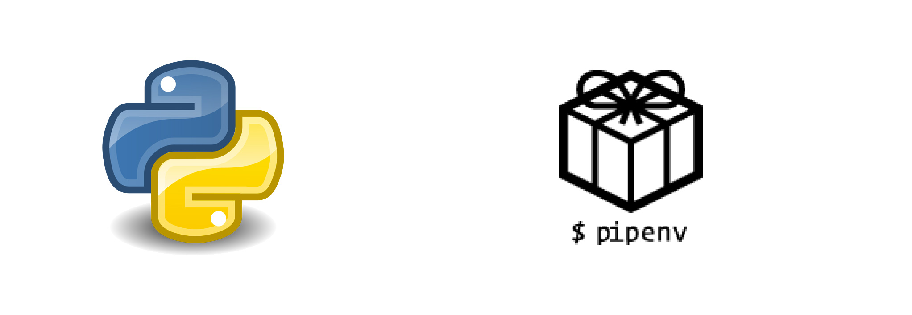

# Fix for problems with Python and pip 
  

## Problem

Today i run in some weird issues installing some tools that after the dependencies where installed the i got error messages that they would not be there. Running direct the Python Shell showed me that its working fine.

After a bit research i found out that Mac have an own Python version and stuff get then mixed up with the version from homebrew. Thought beeing smart and drop an alias got it did not solve the problem since mostly run in the scripts via Shebang.

The fix is to install a tool called `pipenv` for isolationg them from each other (similar like `nvm` for Node.js).

To see how many Python versions are installed run `type -a python`.

## Let's fix it

### Install pipenv

`pip install --user pipenv` 

### Update PATH Variable

Add this folder before $PATH
`echo "$(python -m site --user-base)/bin"`

## How to use it

### Go to your Folder

`cd myproject`

### Install request

`pipenv install requests`

*remember to use always pipenv instead of pip from now!*

### Execute the App

Starting it like before e.g. `./app.py` won't work, you have to run it as well with
`pipenv run python app.py`

Thats it.

Hope i can save others in the future with this tipps some time.

## Contact

## License 

This work by <a xmlns:cc="http://creativecommons.org/ns#" href="https://github.com/ellerbrock" property="cc:attributionName" rel="cc:attributionURL">Maik Ellerbrock</a> is licensed under a <a rel="license" href="https://creativecommons.org/licenses/by/4.0/">Creative Commons Attribution 4.0 International License</a> and the underlying source code is licensed under the <a rel="license" href="https://opensource.org/licenses/mit-license.php">MIT license</a>.
